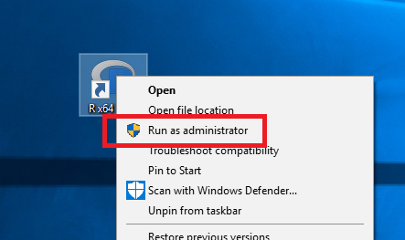

<p align="center">
[](https://github.com/datproject/design)

[](https://travis-ci.org/libscie/datr)
[](https://codecov.io/github/libscie/datr?branch=master)
</p>

The goal of datr is to provide R users with an easy way to interact with the [Dat](https://datproject.org) p2p infrastructure. Please note that this project is released with a [Contributor Code of Conduct](CODE_OF_CONDUCT.md). By participating in this project you agree to abide by its terms.

## Installation

You can install `datr` from GitHub with:

``` r
# install.packages("devtools")
devtools::install_github("libscie/datr")
```

See below for [Windows](#windows), [Mac](#mac), and [Linux](#linux) specific instructions for installing Dat.

### Windows

Fire up `R` *with* Administrator privileges by right clicking the icon and selecting "Run as administrator"

[](https://winaero.com/blog/how-to-run-an-app-as-administrator-in-windows-10/)

Once the program launches, run `datr::dat_install()`. The package then initiates downloading Dat and installs it on your local machine. 

Upon completion, reboot R and you can start using the package 😻 (adminstrator privileges no longer needed)

### Mac

**TO BE ADDED**

### Linux

Run `datr::dat_install(os = 'linux')` from your R console. There's no need to specify which flavor of Linux you're running, but you might to need to restart your R session 🙋

## Example

TO BE ADDED: This is a basic example which shows you how to solve a common problem:

``` r
## basic example code
```

## Roadmap

### v0.1.0

- [ ] Install Dat on your machine
- [ ] Basic functionality of Dat
- [ ] Install R packages hosted on Dat

## Code of conduct

This project is released with a [Contributor Code of Conduct](CODE_OF_CONDUCT.md). By participating in this project you agree to abide by its terms. We welcome you with open arms if you are mindful and respectful of differences. You might not always understand another person's perspective; acknowledging that other people's feelings or perspectives are valid regardless of your understanding is prerequisite number one to being both mindful and respectful. We will not consider contributions if they are not done in a respectful manner, no matter how "genius" they might be.

## License

All code is licensed GPLv3. All non-code assets are available under a [CC 0 Public Domain Dedication](https://creativecommons.org/publicdomain/zero/1.0/legalcode).
